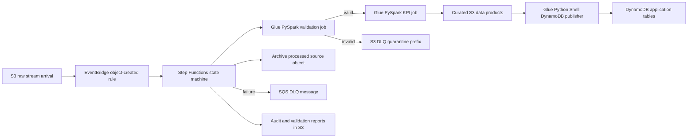

# Architecture

## Context

The pipeline processes music stream batch files that arrive in S3 at unpredictable intervals. Each stream event references a user and a song catalog record. The output is a set of DynamoDB-backed data products designed for downstream application reads.

## Target Flow



## AWS Services

| Service | Responsibility |
| --- | --- |
| Amazon S3 | Raw landing, validation reports, curated outputs, archive, and DLQ quarantine prefixes. |
| Amazon EventBridge | Starts Step Functions when stream files land in the raw prefix. |
| AWS Step Functions | Orchestrates validation, transformation, DynamoDB publishing, archive, and failure handling. |
| AWS Glue PySpark | Performs data-quality validation and KPI transformations at dataset scale. |
| AWS Glue Python Shell | Publishes curated data-product records to DynamoDB with idempotent batch writes. |
| Amazon DynamoDB | Serves downstream applications with purpose-built lookup tables. |
| Amazon SQS | Durable workflow DLQ for failure notifications and reprocessing metadata. |
| AWS CloudWatch | Glue and Step Functions logs, alarms, and operational observability. |

## S3 Layout

```text
s3://<bucket>/raw/songs/songs.csv
s3://<bucket>/raw/users/users.csv
s3://<bucket>/raw/streams/<yyyy>/<mm>/<dd>/<file>.csv
s3://<bucket>/validation/reports/<execution_id>/
s3://<bucket>/curated/daily_genre_kpis/dt=<yyyy-mm-dd>/
s3://<bucket>/curated/daily_genre_top_songs/dt=<yyyy-mm-dd>/
s3://<bucket>/curated/daily_top_genres/dt=<yyyy-mm-dd>/
s3://<bucket>/archive/streams/<yyyy>/<mm>/<dd>/<file>.csv
s3://<bucket>/dlq/streams/<execution_id>/<file>.csv
```

## Orchestration Contract

The Step Functions input is normalized to:

```json
{
  "bucket": "music-streaming-dev-831926601640",
  "key": "raw/streams/2024/06/25/streams1.csv",
  "execution_id": "optional caller-provided id"
}
```

The state machine derives the stream file path, reference catalog paths, report output path, curated output path, and archive path. Each job receives explicit arguments rather than depending on environment-specific hardcoding.

## Failure Strategy

Validation failures are expected business failures. They write a machine-readable validation report, copy the rejected input to the S3 DLQ quarantine prefix, send a compact SQS DLQ message, and stop before publishing incomplete data products.

Unexpected technical failures are caught at the Step Functions level. The workflow sends the original event, state name, error, cause, and execution ARN to the SQS DLQ. Operators can replay by fixing the root cause and restarting the state machine with the original bucket/key.

## Idempotency

- Curated outputs are partitioned by metric date and execution id.
- DynamoDB writes use deterministic keys for each metric date, genre, rank, and track.
- Reprocessing the same file replaces the same logical KPI records instead of creating duplicates.
- Processed files are archived only after successful DynamoDB publication.

## Security Posture

- No long-lived credentials are stored in the repository or Terraform variables.
- IAM permissions are scoped by bucket, table, queue, and Glue job ARN.
- S3 buckets enforce encryption, versioning, blocked public access, and TLS-only access.
- DynamoDB tables use server-side encryption and point-in-time recovery.
- Logs avoid raw PII fields such as `user_name`.
